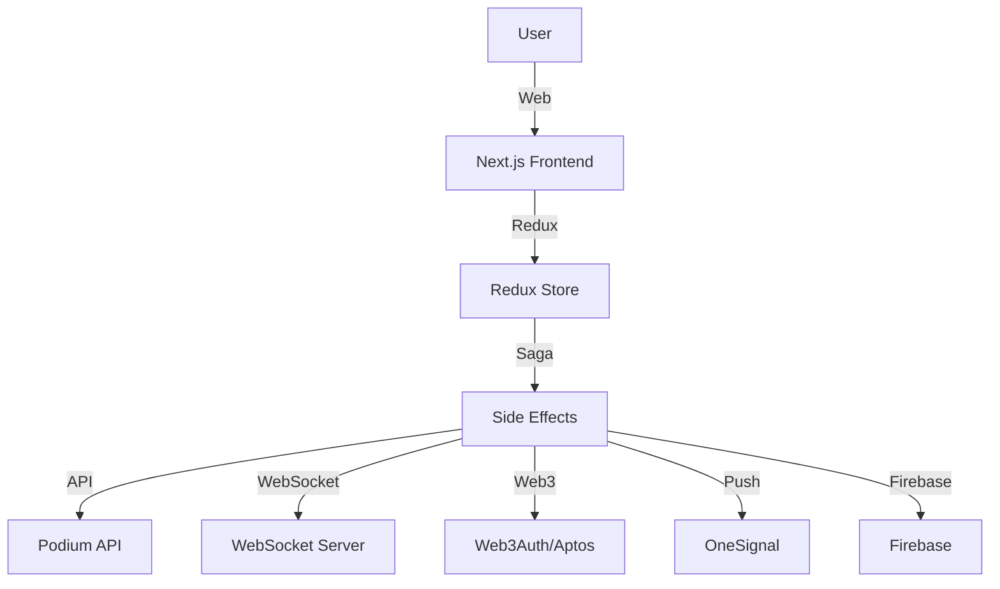
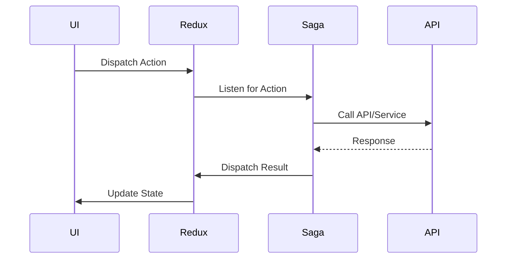

# Nexus


## Overview

Nexus is a modern web application built with Next.js, Redux Toolkit, Redux-Saga, and a modular architecture. It integrates with Web3, Firebase, OneSignal, and custom APIs to provide a real-time, interactive platform for managing and participating in "Outposts"—virtual spaces for collaboration, discussion, and events.

---

## Table of Contents

- [Badges](#badges)
- [Quick Start](#quick-start)
- [Project Structure](#project-structure)
- [Architecture](#architecture)
- [Feature Overview](#feature-overview)
- [Environment Variables](#environment-variables)
- [State Management](#state-management)
- [Side Effects & Sagas](#side-effects--sagas)
- [Slices & Dynamic Injection](#slices--dynamic-injection)
- [Selectors](#selectors)
- [API Reference](#api-reference)
- [Scripts & Development](#scripts--development)
- [Testing](#testing)
- [Deployment & Production](#deployment--production)
- [Troubleshooting & FAQ](#troubleshooting--faq)
- [Contribution Guidelines](#contribution-guidelines)
- [Credits & Acknowledgements](#credits--acknowledgements)
- [License](#license)

---

## Badges


---

## Quick Start

1. **Clone the repo:**
   ```sh
   git clone https://github.com/your-org/nexus.git
   cd nexus
   ```
2. **Copy and configure environment variables:**
   ```sh
   cp env.production.template .env.local
   # Edit .env.local with your values
   ```
3. **Install dependencies:**
   ```sh
   npm install
   ```
4. **Run the development server:**
   ```sh
   npm run dev
   ```
5. **Visit:** [http://localhost:3000](http://localhost:3000)

---

## Project Structure

- `app/` — Next.js app directory, including authenticated/unauthenticated routes and API endpoints.
- `components/` — Reusable UI components (buttons, dialogs, lists, etc.).
- `containers/` — Feature modules, each with its own state slice, saga, selectors, and components.
- `services/` — API clients, WebSocket logic, image upload, and utility services.
- `store/` — Redux store setup, root reducer, root saga, and provider.
- `public/` — Static assets.
- `lib/` — Utility functions and helpers.

---

## Architecture

### High-Level Overview



### State/Data Flow



---

## Feature Overview

| Feature         | Location                   | Description                         |
| --------------- | -------------------------- | ----------------------------------- |
| Outposts        | `containers/outpost*`      | Virtual rooms for events/discussion |
| Notifications   | `containers/notifications` | Real-time and push notifications    |
| Blockchain Pass | `containers/_assets`       | Passes, trading, and balance        |
| User Profiles   | `containers/profile`       | User info, NFTs, account actions    |
| Dashboard       | `containers/dashboard`     | Leaderboards, user stats, tokens    |
| My Outposts     | `containers/myOutposts`    | User's created/joined outposts      |
| All Outposts    | `containers/allOutposts`   | Public outpost listing              |

---

## Environment Variables

Configuration is managed via environment variables. Copy `env.production.template` to `.env.production` and fill in your values.

### Firebase

- `NEXT_PUBLIC_FIREBASE_API_KEY` — Firebase API key
- `NEXT_PUBLIC_FIREBASE_AUTH_DOMAIN` — Firebase Auth domain
- `NEXT_PUBLIC_FIREBASE_PROJECT_ID` — Firebase project ID
- `NEXT_PUBLIC_FIREBASE_STORAGE_BUCKET` — Firebase storage bucket
- `NEXT_PUBLIC_FIREBASE_MESSAGING_SENDER_ID` — Firebase messaging sender ID
- `NEXT_PUBLIC_FIREBASE_APP_ID` — Firebase app ID

### OneSignal

- `NEXT_PUBLIC_ONESIGNAL_APP_ID` — OneSignal app ID for push notifications

### Website

- `NEXT_PUBLIC_WEBSITE_LINK_URL` — Public website URL

### Podium API

- `NEXT_PUBLIC_PODIUM_API_URL` — Base URL for Podium API

### WebSocket

- `NEXT_PUBLIC_WEBSOCKET_ADDRESS` — WebSocket server address for real-time features

### Outpost Server

- `NEXT_PUBLIC_OUTPOST_SERVER` — Outpost server address

### Luma API

- `NEXT_PUBLIC_LUMA_API_KEY` — Luma API key for event integration

### Web3Auth

- `NEXT_PUBLIC_WEB3AUTH_CLIENT_ID` — Web3Auth client ID for authentication

### Aptos/Movement

- `NEXT_PUBLIC_MOVEMENT_RPC_URL` — Movement/Aptos RPC endpoint
- `NEXT_PUBLIC_PODIUM_PROTOCOL_ADDRESS` — Podium protocol contract address
- `NEXT_PUBLIC_CHEER_BOO_ADDRESS` — Cheer/Boo contract address
- `NEXT_PUBLIC_FIHUB_ADDRESS` — FIHUB contract address
- `NEXT_PUBLIC_FIHUB_ADDRESS_APTOS` — FIHUB Aptos contract address

---

## State Management

Nexus uses [Redux Toolkit](https://redux-toolkit.js.org/) for state management, with a modular, feature-based approach:

- Each feature (e.g., outposts, users, notifications) has its own slice in `containers/<feature>/slice.ts`.
- Slices are dynamically injected into the store using the `injectContainer` pattern, allowing for code splitting and on-demand loading.
- The main store is configured in `store/index.ts` and uses `configureStore` from Redux Toolkit.
- The store supports dynamic reducer and saga injection for modularity and scalability.

### Store Setup

- `store/index.ts` — Main store logic, dynamic injection, and type definitions.
- `store/rootReducer.ts` — Combines all static reducers.
- `store/rootSaga.ts` — Combines all static sagas.
- `store/Provider.tsx` — React provider for the Redux store.

---

## Side Effects & Sagas

Asynchronous logic and side effects are handled with [redux-saga](https://redux-saga.js.org/):

- Each feature has its own saga in `containers/<feature>/saga.ts`.
- Sagas handle API calls, WebSocket events, authentication, notifications, and more.
- The root saga (`store/rootSaga.ts`) combines all feature sagas.
- Sagas are dynamically injected alongside reducers for each feature.

### Example Saga Features

- **Authentication & Web3**: Handles Web3Auth, account switching, and login flows.
- **Outposts**: Manages creation, joining, reminders, and live data for outposts.
- **Notifications**: Fetches, marks as read, and deletes notifications.
- **Assets**: Handles blockchain passes, balance, and pass trading.
- **Profile**: Manages user profile, NFTs, and account actions.

---

## Slices & Dynamic Injection

Slices are created using Redux Toolkit's `createSlice` and injected at runtime:

- Each slice exports a `use<Feature>Slice` hook that injects its reducer and saga.
- Example:
  ```ts
  export const useUsersSlice = () => {
    injectContainer({
      name: usersSlice.name,
      reducer: usersSlice.reducer,
      saga: usersSaga,
    });
  };
  ```
- This enables code splitting and only loads state logic when needed.

---

## Selectors

Selectors are used to efficiently access and compute derived state:

- Defined in each feature's `selectors.ts` or `selectore.ts` file.
- Use `createSelector` for memoization and performance.
- Example: `AssetsSelectors.userPasses(id)` returns pass info for a user.

---

## API Reference

> **Note:** Most API calls are proxied through the Podium API and custom endpoints in `app/api/`.

### Example Endpoints

- `GET /api/revalidate/all-outposts` — Revalidates all outposts cache
- `GET /api/revalidate/dashboard/recent-users` — Revalidates recent users
- `GET /api/revalidate/user/[id]` — Revalidates a specific user
- `POST /api/search` — Search functionality
- `GET /api/cookies` — Cookie management

For more, see the `app/api/` directory and [Podium API documentation](https://your-podium-api-url.com/api/v1/docs).

---

## Scripts & Development

### Scripts (from `package.json`):

- `dev` — Start development server with Turbopack
- `build` — Build the app for production
- `start` — Start the production server
- `lint` — Run ESLint
- `tsc` — Run TypeScript compiler
- `postinstall` — Run patch-package after install

### Install & Run

```sh
npm install
npm run dev
```

---

## Testing

> **Note:** Add details here if you have a test suite. If not, this is a good place to describe your testing strategy.

### Running Tests

```sh
npm test
```

- Use [Jest](https://jestjs.io/) for unit tests (add config if available)
- Use [Cypress](https://www.cypress.io/) or [Playwright](https://playwright.dev/) for end-to-end tests
- Add new tests in the `__tests__/` directory or alongside components

---

## Deployment & Production

### Build for Production

```sh
npm run build
npm run start
```

### Deployment Targets

- **Vercel**: Zero-config deployment for Next.js
- **Docker**: Add a `Dockerfile` for containerized deployment
- **Custom Server**: Use `npm run build` and `npm run start` on your own infrastructure

### Required Services

- **Firebase**: Auth, storage, messaging
- **OneSignal**: Push notifications
- **Podium API**: Main backend
- **Web3Auth**: Web3 login
- **Aptos/Movement**: Blockchain integration

### Security Notes

- Never commit `.env.*` files to version control
- Use secret managers for production deployments
- Review CORS and authentication settings

---

## Troubleshooting & FAQ

### Common Issues

- **Web3Auth errors**: Check your `NEXT_PUBLIC_WEB3AUTH_CLIENT_ID` and network settings
- **Missing env vars**: Ensure `.env.local` is present and filled
- **CORS issues**: Check API and WebSocket server CORS settings
- **Push notifications not working**: Verify OneSignal setup and browser permissions
- **Blockchain errors**: Check RPC URLs and contract addresses

### FAQ

- **How do I add a new feature?**
  - Create a new folder in `containers/`, add a slice, saga, selectors, and components
  - Use the `injectContainer` pattern for dynamic loading
- **How do I update environment variables?**
  - Edit `.env.local` and restart the dev server

---

## Contribution Guidelines

1. **Fork and clone the repo**
2. **Create a new branch** for your feature or bugfix
3. **Follow coding standards** (ESLint, Prettier)
4. **Write tests** for new features
5. **Open a pull request** with a clear description
6. **Participate in code review**

### Branching Model

- Use `develop` for ongoing work
- Use `main` for production releases
- Feature branches: `feature/<name>`
- Bugfix branches: `bugfix/<name>`

### PR Process

- Reference issues in your PR
- Add screenshots or demos if UI changes
- Ensure all checks pass before merging

---

## Credits & Acknowledgements

- [Next.js](https://nextjs.org/)
- [Redux Toolkit](https://redux-toolkit.js.org/)
- [Redux-Saga](https://redux-saga.js.org/)
- [Web3Auth](https://web3auth.io/)
- [Firebase](https://firebase.google.com/)
- [OneSignal](https://onesignal.com/)
- [Aptos](https://aptos.dev/)
- [Radix UI](https://www.radix-ui.com/)
- [Tailwind CSS](https://tailwindcss.com/)
- [All contributors](https://github.com/your-org/nexus/graphs/contributors)

---

## License

[MIT](LICENSE)
